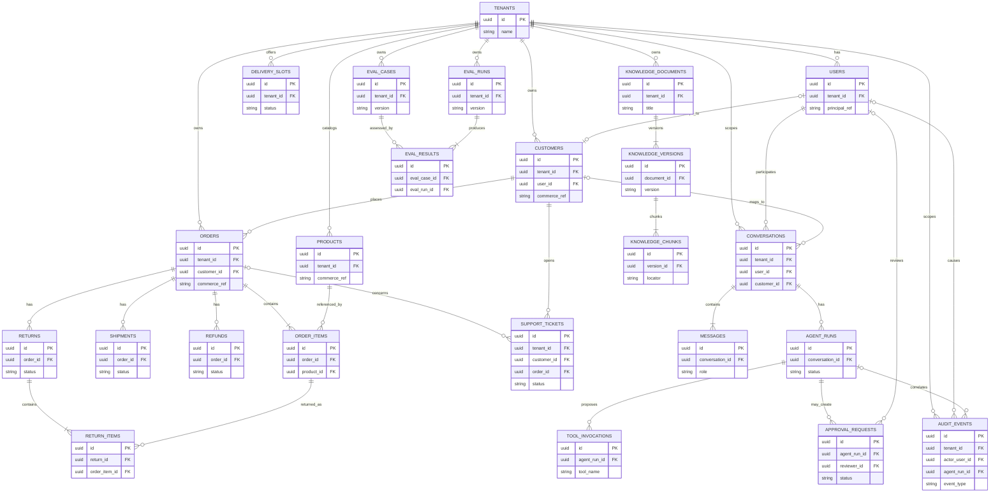

# VerbaOps AI Conceptual Data Model

This Phase 0 model defines ownership, scope, and relationships rather than a physical schema. Most VerbaOps AI domain and AI records are tenant-scoped. NovaCommerce commerce data is conceptually owned by the Commerce Sandbox/API even if future local development shares infrastructure.

## Mermaid ERD

## Entity explanations

- **tenants** are the isolation boundary. NovaCommerce is one tenant in the demo; the platform model remains reusable.
- **users** are authenticated principals with roles and trusted tenant context. **customers** are commerce-domain records; a user may map to a customer.
- **products**, **orders**, and **order_items** describe commerce concepts. A customer owns orders, and an order contains items.
- **shipments**, **refunds**, and **returns** hold order-related state. **return_items** identifies the order items included in a return. **delivery_slots** represents available delivery choices.
- **support_tickets** records customer support work and may reference zero or one order; the conceptual `order_id` is nullable when a ticket is not tied to a specific order.
- **conversations**, **messages**, and **agent_runs** represent durable interaction history. A conversation owns messages and agent runs.
- **tool_invocations** records typed proposals and calls owned by an agent run. **approval_requests** captures human decisions for high-risk actions; approval is bound to the exact proposal. A pending approval request may have no reviewer, so the conceptual `reviewer_id` is nullable until the request is claimed or decided by an authorized reviewer.
- **knowledge_documents**, **knowledge_versions**, and **knowledge_chunks** provide versioned retrieval evidence. Retrieved text is evidence, not trusted instructions.
- **eval_cases**, **eval_runs**, and **eval_results** support versioned evaluation. Results reference both the evaluated case and the run/version context.
- **audit_events** capture security- and business-sensitive events with trusted actor and correlation references.

The logical data model does not grant the Agent Runtime direct table access to NovaCommerce data. Commerce reads and writes cross the authenticated Commerce Sandbox/API boundary.
