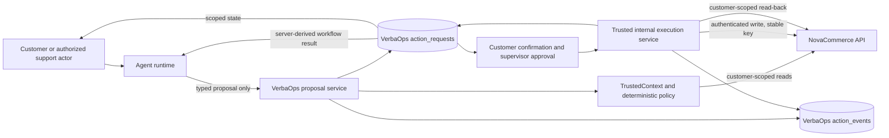

# VerbaOps Stage 6 — Policy, Writes, Confirmation, and HITL

**Status:** Written architecture specification. The approved design direction is carried into this document. Stage 6 implementation planning and runtime implementation have not started.

## 1. Purpose and scope

Stage 6 adds a deterministic, durable action lifecycle around the authenticated NovaCommerce write API. The model may submit typed proposals. VerbaOps stores each proposal, evaluates policy, gathers required customer confirmation and supervisor approval, invokes NovaCommerce from trusted server code, and verifies the resulting business state before reporting success.

The supported actions are delivery rescheduling, eligible order cancellation, return initiation, support-ticket creation, and refund request. Refund request is the primary high-risk approval example. Gates differ by action and resource state; the model never selects or satisfies a gate.

This is a design specification only. It does not authorize an implementation roadmap, schema migration, runtime code, endpoint, tool, UI, or test change.

## 2. Current repository state

The planning branch is `stage6/policy-writes-hitl-planning`, created at Stage 5 merged-main commit `81f71c35a0bc0f49ec70407cf401219851caa940`. At specification start, its worktree was clean and its head and merge-base were that SHA.

Authoritative product requirements are in [docs/product/requirements.md](../../product/requirements.md), especially FR-12 through FR-21, NFR-01 through NFR-09, and the security invariants. Architecture and trust boundaries are described in [docs/architecture/system-overview.md](../../architecture/system-overview.md), [docs/adr/002-llm-trust-boundary.md](../../adr/002-llm-trust-boundary.md), [docs/adr/003-trusted-identity-context.md](../../adr/003-trusted-identity-context.md), and [docs/adr/005-commerce-api-boundary.md](../../adr/005-commerce-api-boundary.md).

Current VerbaOps model-facing Commerce tools are read-only. `CommerceClient` has authenticated read methods and uses a service credential plus a customer-scope header. NovaCommerce already exposes authenticated write routes for cancellation, rescheduling, return creation, support-ticket creation, and refund requests. Those routes validate idempotency keys, hash request fingerprints, enforce customer ownership, and use transactional domain services. Several domain services lock affected rows and emit Commerce events.

The current `ToolInvocation` row is trace data attached to one agent run. Its status constraint is `proposed`, `succeeded`, or `failed`; it cannot represent a customer/supervisor workflow spanning turns. VerbaOps has a server-derived, frozen `TrustedContext` with `principal_id`, `tenant_id`, optional `customer_id`, and roles `customer`, `support_agent`, `support_supervisor`, and `tenant_admin`. The checked-in auth implementation is a development/test provider behind the `AuthProvider` interface.

NovaCommerce currently marks refund amounts greater than `500.00` as requiring manual approval and creates them with `PENDING_MANUAL_APPROVAL`. A refund request is not payment movement. The support-ticket schema has `order_id`, `subject`, and `description`, but no category. NovaCommerce has customer-scoped reads for orders, shipments, and refunds, but no exact-resource read-back for return requests or support tickets.

Stage 5 concluded with `NO_GROUNDING_CANDIDATE_MEETS_M5D_QUALITY_GATE`; no P0–P5 candidate was selected. The result is recorded in [docs/evaluation/stage5-m5d-b-dev-results.md](../../evaluation/stage5-m5d-b-dev-results.md). Stage 6 authorization and write eligibility do not depend on retrieval quality, retrieved documents, or model confidence.

## 3. Stage 6 invariants

1. The LLM is an untrusted proposal generator, never an identity, policy, confirmation, approval, execution, or verification authority.
2. A model-visible operation can propose a typed action, but cannot invoke an executable Commerce write.
3. VerbaOps owns the durable action workflow and confirmation/supervisor decisions. NovaCommerce remains the final authority for customer ownership, domain eligibility, transactional state changes, idempotency, and Commerce events.
4. VerbaOps never mutates NovaCommerce tables or duplicates its transaction logic.
5. Only trusted server code calls a Commerce write, after every required gate passes.
6. Customer confirmation and supervisor approval bind to the same immutable action request and proposal fingerprint.
7. Every logical action retains one stable Commerce idempotency key across retries and reconciliation.
8. `succeeded` means the expected business result was read back and matched. A write response alone is insufficient.
9. Uncertain or mismatched results remain visibly unresolved; no model response can promote them to success.
10. Tenant, principal, and customer scope comes from `TrustedContext` and server-side mappings. Request bodies and model output cannot set or replace it.
11. State transitions and actor decisions are auditable without copying raw user text into audit-event payloads.

## 4. Architectural boundaries and flow

VerbaOps adds an action service, explicit per-action policy functions, proposal-tool handlers, an internal write executor, and customer/supervisor action APIs. Its PostgreSQL database holds the authoritative action request and append-only action events. Existing agent-run and tool-invocation trace data remains intact and links to each action.

NovaCommerce continues to own commerce records and writes. Its authenticated HTTP boundary is extended only where the current contract cannot meet Stage 6 category, refund-approval, or verification requirements. Commerce calls occur outside VerbaOps database transactions.

## 5. Supported actions and initial gates

All five action types require explicit customer confirmation in the initial Stage 6 policy so the affected person sees the exact intended change. Supervisor approval is conditional and action-specific.

| Action | Proposal fields | Customer confirmation | Supervisor approval in initial policy |
|---|---|---|---|
| Reschedule delivery | Order ID and target delivery-slot ID | Required; show current and target date/window and order | Not required in any Commerce-eligible state, including `IN_TRANSIT` |
| Cancel order | Order ID | Required; show order identity and consequence, including that cancellation is not a refund | Required only when an otherwise-eligible order has status `PROCESSING` and/or its shipment has status `LABEL_CREATED`; other eligible states do not require it |
| Initiate return | Order ID, distinct order-item IDs and quantities, reason | Required; show each item/quantity and that a return request does not guarantee a refund | Not required for an otherwise eligible return |
| Create support ticket | Optional order ID, typed category, subject, description | Required; show the exact category and submitted summary | Not required for an ordinary ticket |
| Request refund | Order ID, positive amount, reason, canonical tenant currency | Required; show amount, currency, order, reason, and that approval does not issue payment | Required when amount is greater than `500.00` in the configured NovaCommerce tenant currency; exactly `500.00` does not cross the existing threshold |

Only otherwise-eligible cancellations with order status `PROCESSING` and/or shipment status `LABEL_CREATED` trigger supervisor review; other eligible cancellation states do not. These cancellation holds do not override Commerce eligibility. Rescheduling requires customer confirmation but no supervisor approval in any Commerce-eligible state, including `IN_TRANSIT`. NovaCommerce independently enforces order and shipment state, ownership, slot existence, slot availability/capacity, slot date, and transactional correctness. A non-cancellable order, expired return window, unavailable delivery slot, or amount above the remaining refundable value is denied by Commerce even if a supervisor approved the cancellation risk gate.

The ticket category is a closed enum shared by VerbaOps and NovaCommerce: `order`, `delivery`, `returns_refunds`, `product`, `warranty`, `payment`, `account`, or `other`. User-facing labels may be localized; stored values remain stable keys.

Current Commerce schemas do not carry a currency code. Stage 6 must bind refund amounts and the `500.00` threshold to one explicit NovaCommerce tenant currency supplied by trusted tenant configuration and displayed at confirmation. Neither model nor browser may choose it. If the canonical currency cannot be resolved, refund proposals are denied before confirmation or execution. Stage 6 does not add multi-currency conversion.

## 6. Proposal contract

Model-visible operations are proposal operations, conceptually `propose_reschedule_delivery`, `propose_cancel_order`, `propose_return`, `propose_support_ticket`, and `propose_refund`. Names may follow the existing registry convention.

Each accepts a strict action-specific schema with unknown fields forbidden. Payloads never contain tenant ID, customer ID, principal ID, role, approval/confirmation status, lifecycle state, execution flag, Commerce credential, or arbitrary endpoint/path.

* Reschedule: `order_id`, `delivery_slot_id`.
* Cancel: `order_id`.
* Return: `order_id`, non-empty reason, and distinct `{order_item_id, quantity}` entries with positive bounded quantities.
* Ticket: optional `order_id`, enum category, non-empty bounded subject, and non-empty bounded description.
* Refund: `order_id`, positive decimal amount, non-empty bounded reason. Currency comes from trusted tenant configuration.

The proposal handler validates and normalizes the payload, loads identity and scope only from `TrustedContext`, assigns an action request ID, computes its immutable fingerprint, and durably records the proposal and creation event. It reads required Commerce facts through the authenticated read client, evaluates pure per-action policy against those facts and trusted context, persists the decision/transition, and returns the server-owned workflow state. It never calls a Commerce write.

Action ID and originating tool-invocation/run/conversation links let retries of the same invocation resolve to the same record. A uniqueness constraint on the originating invocation prevents duplicate records for one tool call. An identical active proposal in the same conversation and customer scope returns the active request rather than creating another. A distinct later customer intent can create a new action request, with a new ID and Commerce idempotency key. An active-request uniqueness rule on tenant, conversation, customer, and fingerprint makes lookup-and-create race-safe; a uniqueness conflict resolves by returning the winning active request.

Fingerprint construction is deterministic: SHA-256 over a versioned, domain-separated canonical JSON envelope containing tenant ID, customer ID, action type, proposal schema version, sorted target identifiers, normalized action payload, and material preflight values used in the confirmation view. Canonicalization uses sorted object keys, canonical UUIDs, fixed-scale decimal strings, normalized UTC timestamps, and stable enum values. The fingerprint excludes the action request ID so exact duplicate proposals can deduplicate; each user decision submits both request ID and fingerprint. A changed material value, policy-relevant snapshot, or schema version produces a new fingerprint and action request.

## 7. Durable lifecycle and persistence

Add two VerbaOps persistence concepts.

### `action_requests`

This row is the authoritative current action state. It is tenant- and customer-scoped and contains only data needed to enforce the lifecycle and reconcile writes:

* ID, tenant ID, customer ID, proposing principal ID, conversation ID, originating agent-run ID, and optional originating tool-invocation ID.
* Action type, strict normalized action payload, proposal schema version, immutable proposal fingerprint, and target identifiers.
* Current lifecycle state, policy outcome/reason code/version, and policy observation time.
* Confirmation-required and approval-required flags; bound decision values, actor IDs, timestamps, and fingerprints.
* One stable idempotency key, execution attempt count, current execution lease/attempt metadata, and sanitized Commerce resource/response metadata.
* Verification state, verified resource ID/values, expiry, timestamps, and concurrency version.

It does not duplicate conversation history, raw prompts, credentials, or full provider output. Action payload text is access-controlled because ticket content and reasons may contain personal data.

### `action_events`

Append-only audit rows record proposal creation, policy allow/deny, confirmation/rejection, approval/rejection, execution start, Commerce response, verification, unresolved result, and expiry. Events include tenant/action ID, event type, actor principal or system actor, event time, previous/next state where applicable, proposal fingerprint, correlation IDs, and a bounded reason code. They do not copy ticket descriptions, full prompts, authentication material, or raw Commerce bodies.

Each current-state update and corresponding event commit in one VerbaOps transaction. Current state is not reconstructed from events. Application code exposes no event update/delete operation; database permissions should reinforce append-only access.

`ToolInvocation` remains trace history and links to `action_requests`. It is not changed to carry cross-turn workflow state. Existing conversations, agent runs, tool calls, model-call traces, and audit facilities remain.

## 8. Explicit state machine

The server owns these states:

* `proposed` — typed action durably recorded; policy evaluation is in progress.
* `policy_denied` — policy or an authoritative preflight check denies the proposal.
* `awaiting_approval` — policy allows the action, but a supervisor decision is required.
* `awaiting_confirmation` — required supervisor approval, if any, is bound; customer confirmation is still required.
* `ready_to_execute` — required gates passed; the final freshness check may run.
* `executing` — one server worker owns the persisted execution attempt.
* `succeeded` — the requested postcondition was verified by a customer-scoped Commerce read.
* `rejected` — customer or authorized supervisor explicitly rejected the exact proposal.
* `failed` — definite failure occurred and no success is asserted.
* `unresolved` — a write may have committed or verification is unavailable/mismatched; reconciliation is required.
* `expired` — proposal expired or was superseded before write dispatch.

Allowed transitions:

| From | To | Condition |
|---|---|---|
| `proposed` | `policy_denied` | Trusted scope, action policy, or current resource facts deny the request |
| `proposed` | `awaiting_approval` | Policy allows and supervisor approval is required |
| `proposed` | `awaiting_confirmation` | Policy allows, approval is not required, and customer confirmation is required |
| `proposed` | `ready_to_execute` | Policy allows and neither gate is required |
| `proposed` | `failed` | Policy/read dependency unavailable and no write was dispatched |
| `proposed` | `expired` | Validity elapsed before a usable gate decision |
| `awaiting_approval` | `awaiting_confirmation` | Supervisor approved current fingerprint and customer confirmation remains required |
| `awaiting_approval` | `ready_to_execute` | Supervisor approved and customer confirmation is not required |
| `awaiting_approval` | `rejected` | Customer withdrew before execution or supervisor rejected the exact proposal |
| `awaiting_confirmation` | `ready_to_execute` | Bound customer confirmed the exact fingerprint |
| `awaiting_confirmation` | `rejected` | Bound customer rejected the exact proposal |
| `awaiting_approval` or `awaiting_confirmation` | `expired` | Expiry wins the locked transition race |
| `ready_to_execute` | `executing` | Fresh policy check passes and this transaction claims execution |
| `ready_to_execute` | `policy_denied` | Fresh policy/precondition no longer permits execution |
| `ready_to_execute` | `expired` | Validity elapsed before dispatch |
| `executing` | `succeeded` | Exact expected postcondition is read back and matched |
| `executing` | `failed` | Commerce returns definite business rejection or terminal failure |
| `executing` | `ready_to_execute` | Dispatch is proven not to have happened and a bounded safe retry remains |
| `executing` | `unresolved` | Dispatch/result is ambiguous or read-back is missing/mismatched |
| `unresolved` | `executing` | Internal reconciler claims safe same-key replay under the Commerce contract |
| `unresolved` | `succeeded` | Read-back or same-key replay proves the expected postcondition |
| `unresolved` | `failed` | Reconciliation proves terminal rejection with no desired mutation |
| `unresolved` | `unresolved` | Reconciliation cannot establish a safe definitive result |

`policy_denied`, `rejected`, `succeeded`, `failed`, and `expired` are terminal. `unresolved` is non-success and remains reconcilable; elapsed time never silently converts it to success or failure. A dispatched action cannot expire while its outcome is unknown.

A material correction creates a new action request with a new ID and fingerprint. Before a write is dispatched, the old request moves to `expired` with reason `superseded`; no gate carries over. A proposal is never edited in place after crossing a confirmation or approval boundary.

When both approval and confirmation are required, supervisor review occurs first, then customer confirmation, then execution. This avoids asking the customer to confirm an action already rejected by a supervisor and makes gate order deterministic.

## 9. Deterministic policy engine

Policy is explicit server-side Python logic with separate action evaluators and a small shared transition/gate layer. It is not prompt-encoded or a generic policy language. Pure portions accept `TrustedContext`, normalized proposal values, current Commerce facts, and policy version; they return a typed allow/deny result, required gates, and stable reason codes.

Policy checks, as applicable:

* A customer may propose only for the customer ID in their trusted context. A support agent may propose only when the server has bound that context to the customer; the agent cannot choose a target customer in tool input. A supervisor may propose only if separately authorized as a support agent with a trusted customer binding. A tenant-admin role alone grants neither write-proposal nor approval authority.
* Authenticated principal has an allowed role and server-resolved customer association. A model-provided customer identifier is never accepted.
* Action, conversation, customer, tenant, and current principal are correctly scoped.
* Commerce resource belongs to the trusted customer; cross-customer/tenant existence is not disclosed. Local action reads always pair tenant and customer scope. Because NovaCommerce is currently the single implemented demo tenant, the service rejects a trusted tenant that does not match its configured Commerce binding; the customer ID still comes only from trusted context.
* Current state and material values satisfy the gate matrix, including eligible late-stage cancellation review and the refund threshold.
* Proposal and bound gate decisions are current, unexpired, and fingerprint-identical.
* Current state permits the requested transition.

VerbaOps performs early authorization, schema validation, gate selection, freshness checks, and workflow control. NovaCommerce independently enforces ownership, valid state, slot capacity/date, cancellation eligibility, return window and quantity, remaining refundable amount, ticket ownership, database constraints, transactional locking, idempotency, and Commerce events. A supervisor cannot override a NovaCommerce invariant. A VerbaOps risk hold can be approved only where NovaCommerce would still accept the write. Stage 6 has no free-form exception override: only the named otherwise-eligible late-stage cancellation holds in the action matrix may be cleared by supervisor approval. Other failed policy or business checks are denied.

Policy reads Commerce facts using authenticated customer-scoped reads. These are preflight snapshots, not permission to bypass the later Commerce check. Relevant checks run again before execution, and NovaCommerce remains authoritative under concurrent changes.

## 10. Customer confirmation

Confirmation is an authenticated customer operation on a specific action request and proposal fingerprint. A later conversational `yes` is not an API authorization signal; the agent must identify one current request and the UI submits its exact ID and fingerprint.

The confirmation view is built from the stored proposal and trusted Commerce facts, not model-written prose. It shows action, target, material values, and consequences:

* Reschedule: current and target delivery date/window.
* Cancel: order identity and cancellation effect; cancellation is not a refund.
* Return: selected item/quantity and reason; a return request does not guarantee a refund.
* Ticket: exact category, subject, description, and optional order.
* Refund: exact amount, canonical currency, order, reason, approval state; approval is not payment.

The server requires trusted role `customer` and matching customer ID. It checks tenant/principal scope, expiry, fingerprint, and legal transition under a database row lock. An identical retry returns the recorded result. A different decision after the first decision conflicts. Customer rejection/withdrawal is terminal. A customer may withdraw while the action awaits supervisor approval or customer confirmation; that transition is serialized against supervisor decisions. A customer cannot cancel after execution has been claimed.

The service refreshes material Commerce facts before accepting confirmation. If displayed values or relevant resource state changed, the old proposal expires and a new proposal/fingerprint is required.

## 11. Human-in-the-loop approval

The initial authorized role is `support_supervisor`. The model, customer, proposing agent, and tenant administrator cannot satisfy this gate. A supervisor must be a different principal from the proposer, even if the proposer also has the supervisor role.

The supervisor endpoint returns a tenant-scoped view of the immutable proposal, customer-confirmation requirement, material values, policy reason, and fingerprint. The decision records trusted supervisor principal, time, decision, and fingerprint. Approval is accepted only while the action is `awaiting_approval`, unexpired, and current. Rejection is terminal. Identical repeat decisions are idempotent; conflicting decisions are rejected.

Refunds over `500.00` in tenant currency and otherwise-eligible cancellations with order status `PROCESSING` and/or shipment status `LABEL_CREATED` require this gate. Delivery rescheduling, including for Commerce-eligible `IN_TRANSIT` shipments, requires customer confirmation only and never requires supervisor approval in the initial policy. Ordinary returns and tickets do not require supervisor approval.

### Refund approval and NovaCommerce contract

VerbaOps can know before execution that the refund threshold requires supervisor review. The supervisor approves the exact stored proposal before VerbaOps asks NovaCommerce to create a refund request.

The existing NovaCommerce endpoint would otherwise create a `PENDING_MANUAL_APPROVAL` record even after VerbaOps approval, creating a second unbound approval state. Stage 6 therefore requires a narrow internal contract evolution: the authenticated VerbaOps refund call carries a server-generated approval reference bound to the action request ID and proposal fingerprint. The model and browser cannot supply it. NovaCommerce accepts it only from the authenticated VerbaOps boundary, independently recalculates threshold and business eligibility, and records the reference in its Commerce event. For an amount above threshold, missing approval evidence is a no-mutation rejection; with a valid internal reference the request is recorded as `approved`. The existing `requires_manual_approval` field indicates that the amount crossed the manual-review threshold; the status indicates the required review has been satisfied.

This approval permits the refund request to proceed in the business workflow. It does not mean money moved, a payment processor was called, or a refund was settled. NovaCommerce still checks remaining balance, ownership, and current state. If it returns `PENDING_MANUAL_APPROVAL` after receiving the VerbaOps approval reference, VerbaOps records `unresolved`, reports the known pending status without claiming approval, and does not create another logical refund request.

## 12. Execution boundary

Only an internal VerbaOps execution service can call explicit write methods added to `CommerceClient`. They are not registered in the model tool registry. The service requires:

1. Allowed deterministic policy.
2. Required supervisor approval followed by required customer confirmation.
3. An unexpired, fingerprint-matching proposal.
4. Fresh pre-execution facts and an atomic claim of `ready_to_execute`.

The service commits `ready_to_execute -> executing` and an `execution_started` event before HTTP dispatch. It calls a fixed customer-scoped NovaCommerce route selected by action type: `POST /v1/orders/{order_id}/cancel`, `POST /v1/orders/{order_id}/reschedule`, `POST /v1/returns`, `POST /v1/support-tickets`, or `POST /v1/orders/{order_id}/refunds`. It sends the service credential, trusted customer-scope header, typed request, and stable idempotency key. It accepts no arbitrary URL or endpoint, and credentials/customer scope are never model-visible.

The HTTP call and read-back occur outside a VerbaOps database transaction. The service records bounded response metadata and each transition/event in short transactions; it does not hold a database transaction across network I/O.

## 13. Idempotency and retry semantics

Each action request gets one opaque stable key, such as a domain-separated value derived from its random action ID. It contains no customer name, order data, ticket text, amount, or other sensitive value. The key is stored once and reused for every attempt/reconciliation. A corrected or new proposal gets a new ID and key.

The key is sent unchanged as `Idempotency-Key`. NovaCommerce already binds it to operation, customer, targets, and canonical request fingerprint; reuse for another request is rejected. Stage 6 preserves that contract and requires retention long enough to cover the action and reconciliation lifetime.

* **Proven pre-dispatch failure:** bounded retry is safe; reuse the same action and key.
* **Definite business rejection:** no automatic retry; persist `failed` with a sanitized code.
* **Timeout/transport failure after dispatch:** outcome is ambiguous. Do not create a new request or key. First perform exact customer-scoped read-back. If that does not prove the result, use same-key replay only under the NovaCommerce idempotency guarantee.
* **Malformed or contradictory response:** preserve request ID/key, record protocol issue, and reconcile. A 2xx response alone never establishes success.
* **LLM/provider failure:** it may stop response generation but cannot approve, execute, or alter action state.

Read retry policy is not reused for writes. Retry count and backoff are bounded by the internal Commerce client contract. If the bound is reached after possible dispatch, retain `unresolved`.

## 14. Post-write verification

Each action has a resource-specific postcondition checked against immutable identifiers and material values returned by NovaCommerce:

| Action | Read-back | Required match |
|---|---|---|
| Cancel | Existing customer-scoped order read | Same order ID has cancelled status |
| Reschedule | Existing customer-scoped shipment read | Same order/shipment has requested delivery-slot ID and material slot values |
| Return | New customer-scoped `GET /v1/returns/{return_id}` | Same return ID, order, reason, item IDs/quantities, and requested status |
| Ticket | New customer-scoped `GET /v1/support-tickets/{ticket_id}` | Same ticket ID, customer/order, category, subject, description, and open status |
| Refund | Existing customer-scoped refunds-for-order read | Same refund ID, amount, reason, and expected approved status; payment completion is not inferred |

The two new exact-resource reads are limited to one return or ticket owned by the trusted customer. They do not expose cross-customer existence or add broad list/search APIs. Ticket read-back includes category.

Only a match transitions to `succeeded`. Missing, unavailable, or disagreeing verification transitions to `unresolved`. The user-facing result says the outcome is unverified or explicitly reports a known pending state; it does not say the action completed. A return in `requested` and ticket in `open` mean the request/ticket was created, not that a return/refund or support issue is resolved.

## 15. API design

The minimum VerbaOps HTTP surface is actor-oriented:

* `GET /v1/action-requests/{action_request_id}` — fetch scoped state and safe proposal summary.
* `POST /v1/action-requests/{action_request_id}/confirmation` — customer confirms the supplied fingerprint.
* `POST /v1/action-requests/{action_request_id}/rejection` — customer rejects the supplied fingerprint.
* `POST /v1/action-requests/{action_request_id}/approval` — supervisor approves the supplied fingerprint.
* `POST /v1/action-requests/{action_request_id}/approval-rejection` — supervisor rejects the supplied fingerprint.
* `POST /v1/action-requests/{action_request_id}/reconciliation` — action owner or authorized supervisor asks the server to reconcile an unresolved result. It calls only exact-resource reads or contractually safe replay with the same key.

These are conceptual route shapes; internal transitions are services, not public state-setting endpoints. There is no public execute endpoint. The gate operation that satisfies the last requirement invokes the trusted executor. Callers cannot submit lifecycle state, actor, customer ID, tenant ID, role, policy result, or idempotency key.

Every route authenticates through the trusted-context dependency and scopes by tenant and principal/customer. Cross-scope IDs return non-enumerating not-found behavior. Illegal/stale state or fingerprint decisions conflict; invalid inputs return validation errors; dependency failures use the existing sanitized error envelope. Status reads do not trigger writes.

## 16. Agent, web, and voice integration

The agent recognizes intent, calls a proposal tool, and receives server-owned status: denied, awaiting approval, awaiting confirmation, ready/executing, succeeded, failed, or unresolved. It explains only that state and the next actor operation. It does not decide whether a gate passed, execution occurred, or verification matched. Pending actions come from the action service, not model memory.

The customer UI shows the exact proposal and confirmation/rejection controls, pending approval, and verified/failed/expired/unresolved status. The supervisor UI provides minimal scoped review and approve/reject controls; no assignment queue or broad dashboard is required. The browser calls through the existing server-only Next.js BFF pattern. Service credentials stay server-side.

The production end-user session flow is incomplete. Stage 6 uses the existing `AuthProvider` and `TrustedContext` seams and deterministic development/test contexts. Production identity-provider and browser-session delivery remain separate deployment work. No API accepts role, tenant, principal, or customer identity from browser input or model output. `support_supervisor` is resolved only from trusted auth.

For voice, only a stable final transcript may lead to a proposal. The user must hear or see the same material summary and explicitly confirm that action request. Partial, interrupted, or revised transcripts do not authorize execution.

## 17. Concurrency and crash recovery

Use PostgreSQL row locks or compare-and-swap updates on `action_requests` plus a monotonic version. Unique constraints cover action ID, originating invocation, stable idempotency identity, and the active-request scope/fingerprint rule described above. State update and audit event are atomic. In-memory locks are not a correctness boundary.

* Two customer confirmations serialize; the first valid decision wins. An identical retry is idempotent; the opposite decision conflicts.
* Confirm versus reject locks the same row; only one can leave `awaiting_confirmation`.
* Two supervisor decisions serialize; only one can leave `awaiting_approval`. Customer withdrawal while awaiting approval serializes against supervisor approval/rejection; the first valid locked transition wins.
* Two executions race to claim `ready_to_execute`; one changes it to `executing` and the other returns current state.
* Expiry and gate decisions lock the same row; exactly one transition wins.
* Commerce state may change after a VerbaOps read. The executor rechecks before dispatch and NovaCommerce repeats checks under transactional locks.
* A crash after `executing` is committed is ambiguous until read-back or same-key replay resolves it. Reconciliation uses a persisted execution lease and cannot mint a new key.
* Reconciliation claims serialize; concurrent refresh requests cannot execute distinct writes.

Proposal gate expiry is 24 hours from creation. Expiry is checked under the same action row lock as confirmation, approval, and execution claim. A dispatched or unresolved action does not expire out of its audit/reconciliation path.

## 18. Failure model

* **Invalid proposal:** schema rejection; no Commerce call.
* **Unauthorized or cross-scope request:** sanitized, non-enumerating denial; no mutation.
* **Policy denial/business ineligibility:** record `policy_denied`, reason code, and event; do not call a write.
* **Expired, superseded, or stale proposal:** invalidate gates and require a new proposal where correction is appropriate.
* **Commerce definite conflict/rejection:** `failed`; no automatic retry.
* **Commerce unavailable before dispatch:** bounded same-key retry; otherwise `failed` if non-dispatch is certain.
* **Commerce timeout after dispatch/unknown response:** `unresolved`; read back and replay only if safe.
* **Verification unavailable/mismatch:** `unresolved`, never success.
* **Provider outage:** clear recovery response; persisted action state remains authoritative.

Public messages omit protected existence details, raw upstream bodies, service credentials, and stack traces. A result may say completion could not be verified without implying that no write occurred.

## 19. Security and privacy

The boundary is: AuthProvider establishes identity; VerbaOps validates typed proposals and transitions; the model proposes but is untrusted; NovaCommerce authenticates the VerbaOps service and enforces final domain rules; PostgreSQL constraints and locks protect durable state.

Mitigations include strict schemas against argument smuggling, no model-facing write methods, exact fingerprint binding against replay/substitution, proposer/approver separation, non-enumerating scope checks, stable idempotency against duplicate effects, and server-only credential handling. Retrieved knowledge is untrusted evidence and cannot grant write permission.

Ticket descriptions and reasons may contain PII. Store only action payload required to execute, confirm, approve, verify, and audit. Restrict payload access to the scoped customer and authorized supervisor workflow. Events record identifiers, fingerprints, reason codes, and actor/time metadata rather than duplicating text. Logs and traces redact credentials and minimize PII under NFR-07.

## 20. Existing contract gaps and required evolution

1. **No durable VerbaOps action lifecycle:** `ToolInvocation` is run-scoped with three statuses. Add `action_requests` and `action_events`.
2. **No exact customer confirmation or supervisor workflow:** decisions must be durable authenticated actor operations bound to the proposal fingerprint.
3. **No return/ticket read-back:** add only customer-scoped exact-resource reads for return and ticket IDs.
4. **No support-ticket category:** add the closed enum to NovaCommerce request, response, persistence, relevant Commerce event metadata, OpenAPI contract, and VerbaOps proposal.
5. **Refund approval detached from VerbaOps:** evolve the authenticated NovaCommerce refund contract to accept the server-generated fingerprint-bound approval reference and persist it in the Commerce event. Threshold and refund eligibility remain independently enforced by NovaCommerce.
6. **Currency is implicit in current Commerce money fields:** provide one trusted tenant currency for display and threshold interpretation before enabling refund proposals. Missing currency fails closed.
7. **Production auth is absent:** retain the current auth abstraction for Stage 6; production identity-provider and browser-session delivery are later deployment work, not a reason to accept caller-supplied identity.

These are focused contract changes around the approved modular architecture. They do not move Commerce data or business rules into VerbaOps.

## 21. Testing strategy for the later implementation

Use deterministic contexts and a stubbed NovaCommerce HTTP boundary; no live provider or paid LLM call is required.

* Pure policy tests cover action/role/state/gate branches, including Commerce-eligible `IN_TRANSIT` rescheduling with customer confirmation and no supervisor approval, and the `500.00` boundary.
* Persistence tests cover transitions, immutable fingerprints, atomic events, scope predicates, uniqueness, idempotency, and expiry races.
* API tests cover actor roles, exact-fingerprint decisions, rejection, repeated-decision idempotency, and non-enumerating cross-scope behavior.
* Commerce client contract tests cover typed writes, auth/customer/idempotency headers, sanitized errors, and refund approval reference.
* Integration tests cover new reads, category persistence, stale business state, row-lock races, retries/replay, crash recovery, and exact post-write verification.
* Agent/tool tests prove the model can propose but cannot invoke the executor or set trusted identity/state.
* End-to-end tests prove no success claim without matching read-back and no voice partial/interrupted transcript can pass confirmation.

No test code or test run is part of this design-only task.

## 22. Alternatives rejected

### Direct model-facing write tools

Rejected. A probabilistic model must not possess an executable mutation tool whose safety depends on model behavior.

### Reusing `ToolInvocation` as workflow state

Rejected. It belongs to one run, has inadequate states, and cannot be the durable source for later customer/supervisor decisions.

### Generic BPM or workflow engine

Rejected. Five explicit action types and a small finite lifecycle do not justify Kafka, Temporal, or another workflow platform.

### Prompt-encoded authorization

Rejected. Prompts are defense-in-depth guidance, not deterministic authorization controls.

### NovaCommerce-owned confirmation/HITL UI

Rejected as the primary workflow. VerbaOps owns agent orchestration and trusted conversational action state. NovaCommerce remains final business-write authority and stores the Commerce representation of an accepted refund approval reference.

### Direct VerbaOps Commerce-database writes

Rejected. They bypass NovaCommerce ownership, locking, idempotency, write fingerprints, and Commerce events.

## 23. Explicit non-goals

Stage 6 does not introduce a generic workflow engine, Kafka, Temporal, a microservice split, multi-agent architecture, arbitrary model writes, autonomous high-risk refunds, payment processing, real courier/CRM integrations, a production identity provider, generalized policy DSL, broad admin dashboard, recommendation engine, Stage 5 grounding redesign, or P6.

## 24. Stage 6 completion criteria

Later implementation is complete only when evidence demonstrates that:

1. The model can propose but cannot directly execute a business mutation.
2. Every accepted proposal is typed and durably stored.
3. Deterministic policy gates each executable action.
4. Customer confirmation binds to the exact immutable proposal.
5. The initial supervisor workflows are limited to otherwise-eligible cancellations with order status `PROCESSING` and/or shipment status `LABEL_CREATED`, and refunds above `500.00`; each requires an authorized, separate supervisor. Delivery rescheduling, including in `IN_TRANSIT`, has no supervisor gate.
6. Stale/materially changed proposals invalidate prior confirmation and approval.
7. Writes execute only through authenticated NovaCommerce APIs.
8. Each logical action has one stable idempotency key.
9. Ambiguous write outcomes are reconciled safely.
10. Post-write verification controls the final user-visible success claim.
11. Unresolved verification is never represented as success.
12. Every lifecycle transition and decision is auditable.
13. Tenant/customer isolation remains intact.
14. Database concurrency controls prevent two executions of one action.
15. Stage 5 failed grounding candidates are not promoted as an authorization source.
16. Refund approval status is not described as payment movement or settlement.
17. Return and ticket creation are verified through customer-scoped reads and tickets have a typed category.

## 25. Scope and self-review

This is one coherent Stage 6 architecture suitable for one later implementation roadmap. Cross-cutting work is bounded to VerbaOps durable actions and gates, the existing NovaCommerce contract, agent/API/web integration, and deterministic verification. These are parts of one action lifecycle, not independent subsystems.

The state table, transition rules, gate ordering, refund behavior, and API operations agree. All five actions require customer confirmation. Initial supervisor approval is limited to otherwise-eligible cancellations with order status `PROCESSING` and/or shipment status `LABEL_CREATED`, and refunds above `500.00`. Rescheduling, including for Commerce-eligible `IN_TRANSIT` shipments, requires customer confirmation only and no supervisor approval. VerbaOps owns workflow authorization and decisions; NovaCommerce owns final eligibility and transactional write rules. A refund can be approved as a request without representing a payout. Return and ticket verification have exact-resource contracts. Production authentication remains outside Stage 6 runtime scope. Stage 5 grounding evidence remains separate and unchanged.

No unresolved placeholder or unspecified core gate remains in this specification.
