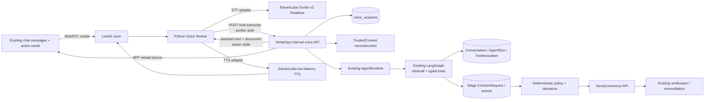

# VerbaOps Stage 7 — Browser Realtime Voice Design

**Status:** HUMAN-APPROVED architecture recorded as the formal Stage 7 design specification.

**Date:** 2026-10-07

**Repository baseline:** `main` and `origin/main` both resolve to `8926d54bbef4422fcf3bb861a36de1ad6dcd5200`.

**Planning branch:** `stage7/realtime-voice-planning`

This document is design documentation only. It does not implement Stage 7, create
`0007_voice_sessions_v1`, change runtime or browser code, add dependencies, make
provider calls, or define the implementation roadmap. No unresolved architecture
contradiction was found during the repository audit.

## 1. Status and decision

Stage 7 adds a safe realtime browser voice channel to VerbaOps. Voice is a new
input/output channel over the existing VerbaOps Agent Runtime and Stage 6 action
boundary. It is not a second business-agent architecture.

The locked decision is the following cascaded pipeline:

```text
Browser microphone
  → LiveKit WebRTC
  → Python LiveKit Agents Voice Worker
  → streaming STT
  → explicit stable FINAL transcript
  → existing VerbaOps AgentRuntime
  → existing LangGraph, tools, policy, and ActionRequest lifecycle
  → TTS
  → LiveKit audio
  → browser speaker
```

The reference speech stack is ElevenLabs Scribe v2 Realtime for STT and
ElevenLabs low-latency multilingual TTS, initially a low-latency model such as
Flash v2.5 where supported by the selected maintained LiveKit plugin/version.
The providers are Stage 7 reference integrations, not a permanent multilingual
quality conclusion.

The design preserves the following permanent boundaries:

- only an explicit STT FINAL transcript can enter the durable VerbaOps turn path;
- the Voice Worker coordinates audio and calls a narrow VerbaOps internal boundary;
- the Voice Worker has no Commerce credentials, policy authority, or business write client;
- the LLM can propose typed actions but cannot confirm, approve, execute, or verify them;
- spoken confirmation is a deterministic state machine bound to an exact ActionRequest and proposal fingerprint;
- the durable Stage 6 ActionRequest remains the only action authority;
- English is the Stage 7 quality language; Arabic and code-switch checks are plumbing smoke only.

## 2. Purpose

The purpose of Stage 7 is to let an authenticated NovaCommerce customer use the
existing VerbaOps conversation by browser microphone while retaining the same
identity, persistence, reasoning, tool, policy, approval, confirmation,
execution, verification, failure, and audit boundaries as text.

The design provides enough structure to implement and measure:

1. trusted browser voice-session bootstrap;
2. LiveKit transport and a separately deployable Voice Worker;
3. explicit final-transcript handling;
4. shared text/voice conversation continuity;
5. deterministic spoken action confirmation;
6. interruption, barge-in, failure, and reconnect behavior;
7. provider-free automated safety coverage and bounded real-provider validation.

## 3. Scope

### In scope

- LiveKit WebRTC transport, browser LiveKit SDK/components, and a Python LiveKit Agents Voice Worker;
- one configured STT implementation and one configured TTS implementation behind narrow provider seams;
- VAD, LiveKit-supported turn detection, interruption, and barge-in;
- authenticated customer voice-session bootstrap and end-session operations;
- one durable `voice_sessions` concept in migration `0007_voice_sessions_v1`;
- narrow AgentRun channel provenance for text versus voice;
- final transcripts persisted as normal VerbaOps user messages when they are submitted to `AgentRuntime`;
- assistant text, existing model/tool/action traces, and bounded voice-session metadata;
- deterministic spoken summaries and customer confirmation/withdrawal through existing Stage 6 services;
- provider-free fakes and regression tests;
- a controlled English real-provider validation and small Arabic/code-switch plumbing smoke.

### Out of scope

Stage 7 does not expand the business domain, replace Stage 6, select a production
deployment topology, or claim multilingual quality. The explicit non-goals are
listed in section 29.

## 4. Existing baseline and repository audit

### 4.1 Verified repository state

The approved Stage 6 merge baseline is `8926d54bbef4422fcf3bb861a36de1ad6dcd5200`.
Both local `main` and `origin/main` resolve to that SHA. The planning branch is
created from that commit. The primary checkout used for inspection was on an
older feature branch with pre-existing untracked `.worktrees/`, `artifacts/`,
and `docs/learning/`; those user-owned files were preserved. Stage 7 design work
was isolated in a clean worktree for `stage7/realtime-voice-planning`.

The repository contains migrations through `0006_action_lifecycle_v1`. This
specification expects `0007_voice_sessions_v1`; it does not create or modify a
migration.

### 4.2 Existing identity and API boundary

The FastAPI API authenticates an opaque bearer credential through the
`AuthProvider` contract and produces a frozen server-derived `TrustedContext`
containing `principal_id`, `tenant_id`, optional `customer_id`, and trusted
roles. Current customer routes require customer authority. Request bodies do not
define tenant, principal, customer, or role values.

Stage 7 extends this boundary with customer voice-session routes and a separate
server-side worker-authenticated internal route. The browser never supplies
authoritative identity or worker credentials.

### 4.3 Existing conversation and runtime ownership

The current conversation domain persists `Conversation`, `Message`, `AgentRun`,
`ModelCall`, and `ToolInvocation`. A conversation is scoped by trusted tenant
and principal and may carry the server-resolved customer. `ConversationService`
wraps short database transactions. `start_turn` locks the conversation,
recovers stale runs, and preserves a partial unique index enforcing one running
`AgentRun` per conversation. `complete_turn` persists the assistant message
and completes the run; `fail_turn` records a bounded error code.

`AgentRuntime.run_turn` validates content, starts the durable turn, loads the
conversation history, invokes the existing LangGraph graph, persists model and
tool traces, completes the assistant message, and returns server-owned action
summaries. `AgentContext` already carries trusted context and runtime services.
There is no voice runtime or channel parameter today; Stage 7 adds only the
smallest mode/provenance input needed to reuse this lifecycle.

The Stage 6 registry exposes typed Commerce reads and proposal tools. The
proposal tools create durable ActionRequests; they do not execute Commerce
writes. No Stage 7 voice-specific registry or graph is introduced.

### 4.4 Existing Stage 6 action boundary

Migration `0006_action_lifecycle_v1` supplies durable `action_requests` and
append-only `action_events`. Current Stage 6 services include proposal,
transition, decision, execution, verification, and reconciliation ownership.
The action view exposes server-owned state, safe summary, exact proposal
fingerprint, required next actor, and permitted operations.

The implemented lifecycle and API already provide:

- exact fingerprint-bound customer confirmation and rejection;
- supervisor approval before customer confirmation for frozen high-risk cases;
- proposer/approver separation and self-approval prohibition;
- stable idempotency keys;
- locked transitions and same-decision idempotent replay;
- conflicting or stale decisions rejected;
- execution only after all required gates;
- exact postcondition verification;
- unresolved state for ambiguous outcomes;
- reconciliation without creating a new logical write;
- customer/supervisor-scoped server-owned views.

Voice calls these same services and endpoints. It does not add a second action
state machine or business write path.

### 4.5 Existing browser and deployment conventions

The current browser is an existing Next.js chat experience. `Chat` stores only
the conversation ID in `sessionStorage`, reloads durable messages and active
ActionRequests through the server-backed conversation API, and renders the
existing `ActionRequestCard`. The Next.js BFF forwards fixed routes with a
server-only VerbaOps token; browser code does not receive the backend token or
Commerce credentials. Stage 7 extends this chat with a reusable `VoicePanel`.

The current Python application owns database, Redis, LLM, Commerce, retrieval,
conversation, action, and agent-runtime resources from the FastAPI lifespan.
The existing `src/verbaops/worker` is a background worker boundary, not a
realtime voice worker. Stage 7 may add a separate Voice Worker runtime and
local wiring in the future, but does not turn the current deployment into
Kubernetes, production TURN infrastructure, or a high-availability platform.

### 4.6 Stage 5 preservation

Stage 5 remains exactly:

```text
NO_GROUNDING_CANDIDATE_MEETS_M5D_QUALITY_GATE
```

Stage 7 does not promote a grounding candidate, rerun P4/P5, access release
holdout data, or imply that voice acceptance validates RAG quality. If approved
production retrieval is used in a voice turn, it follows the existing retrieval
profile and evidence boundaries.

## 5. Requirements traceability

| Requirement | Stage 7 design mapping |
|---|---|
| FR-01 | Final voice turns use the existing Conversation, Message, AgentRun, ToolInvocation, and ActionRequest persistence. Voice sessions add only bounded transport/lifecycle metadata. |
| FR-02 | Bootstrap derives all identity from `TrustedContext`; the internal worker endpoint reconstructs trusted context from the server-owned voice session. Browser, LiveKit metadata, STT, and LLM output cannot set identity. |
| FR-03 | Voice-session creation, transcript submission, conversation reads, and action decisions are tenant/customer scoped by server-owned IDs and existing authorization. |
| FR-04 | Voice-originating AgentRuns link to `voice_session_id`; existing model, tool, action, approval, outcome, and latency traces remain linked to the same conversation and run. |
| FR-16 | Existing typed read/proposal tools remain the only business tools. The Voice Worker has no business tool registry. |
| FR-17 | Spoken confirmation is bound to the exact durable ActionRequest and proposal fingerprint and reuses Stage 6 decision services. |
| FR-18 | High-risk voice proposals remain in `awaiting_approval` until an authenticated supervisor uses the existing browser workflow. There is no supervisor voice approval. |
| FR-19 | Deterministic server policy, trusted context, locked transitions, and existing action APIs remain authoritative. |
| FR-20 | Final voice turns follow the existing proposal → policy → confirmation/approval → authenticated Commerce operation → verification pipeline. |
| FR-21 | STT, TTS, LiveKit, Agent Runtime, and Commerce failures produce bounded recovery responses and never invent business success. |
| FR-23 | Voice presentation guidance preserves the input language where provider behavior supports it; the English Stage 7 confirmation grammar is explicitly bounded and does not weaken policy. |
| FR-24 | LiveKit streams browser audio in and out, VAD/turn detection provides turn state, and barge-in interrupts playout without authorizing a write. |
| FR-25 | Only a stable final transcript reaches the runtime; typed Stage 6 proposals, deterministic gates, complete spoken summary playout, and exact confirmation are required for voice writes. |
| FR-27 / NFR-12 | Stage 7 records bounded speech-end-to-final, runtime, TTS-first-audio, speech-end-to-first-audio, and total-turn latency measurements against the p95 ≤3 second speech-end-to-first-audio target. |
| NFR-03 | One configured provider per stage, bounded timeouts, safe error handling, and no provider failover or fallback graph. |
| NFR-04 | Correlation spans/events retain tenant, conversation, voice session, AgentRun, and ActionRequest IDs while minimizing transcript logging. |
| NFR-05 | No model, browser, provider, or LiveKit event can replace trusted identity. |
| NFR-06 | LiveKit, STT, TTS, worker, VerbaOps, and Commerce credentials stay server-side and are never persisted in voice-session rows or sent to the browser. |
| NFR-07 | No raw audio, recordings, biometrics, embeddings, or arbitrary provider payloads are persisted; logs use bounded metadata and identifiers. |

## 6. Architecture overview



The VerbaOps API owns durable session state, trusted context reconstruction,
conversation concurrency, AgentRuntime invocation, structured action state, and
all business authority. LiveKit owns media transport. The Voice Worker owns
realtime coordination only. STT and TTS are provider boundaries, not business
boundaries.

## 7. Trust boundaries

| Boundary / actor | May provide | Must not establish | Deterministic control |
|---|---|---|---|
| Browser | Microphone media, optional existing conversation ID, UI intent to start/end voice | Tenant, customer, principal, role, room, participant, worker, agent, action state, or credentials | BFF validates the bounded body; API derives scope from authenticated context. |
| LiveKit transport | WebRTC media and transport/session events | VerbaOps authorization or durable action state | Server-minted token and opaque server-generated identity; data packets are hints/cache invalidations only. |
| Voice Worker | Final transcript submission, bounded worker lifecycle events | Identity, tenant/customer/role, Commerce operation, policy result, confirmation authority | Dedicated worker credential; internal endpoint loads `voice_sessions` and reconstructs trusted context. |
| STT provider | Partial and explicit final transcript events | Business turn status, customer identity, action intent authority | Only explicit FINAL events can be bridged; partial events are never passed to `AgentRuntime`. |
| LLM / AgentRuntime | Language interpretation, retrieval use, typed proposal selection, response text | Identity, authorization, policy, confirmation, approval, execution, verification | Existing tool registry, deterministic policy, action transitions, and server-owned response projections. |
| TTS provider | Audio synthesis | Business result or action state | TTS consumes server-owned assistant text/summary; synthesis failure cannot change durable state. |
| VerbaOps API and database | Trusted identity, durable state, action authority | — | Existing scoped repositories, locked transitions, and one-running-AgentRun constraint. |
| NovaCommerce API | Commerce ownership, eligibility, transactional write, read-back facts | VerbaOps voice authorization | Existing authenticated Commerce boundary, stable idempotency, and exact verification. |

## 8. Voice session lifecycle

### 8.1 Bootstrap flow

1. The authenticated customer calls `POST /v1/voice/sessions` through the existing
   server-only BFF. The body may contain only an optional existing
   `conversation_id`.
2. The API requires customer authority in `TrustedContext`.
3. If a conversation ID is supplied, the API loads it in the existing trusted
   tenant/principal scope and requires its server-owned customer to equal the
   authenticated customer. A mismatch is returned as a non-enumerating not-found
   or forbidden result according to current API conventions.
4. If no conversation ID is supplied, the existing conversation service creates
   a customer-scoped conversation.
5. The API creates a durable `voice_session` in `created`, generates an opaque
   LiveKit room and participant identity, and mints a short-lived token with only
   the required room grants.
6. The response returns the voice-session ID, conversation ID, LiveKit URL, and
   short-lived room token. It does not return any API secret or worker credential.
7. The browser connects to LiveKit. The LiveKit job/dispatch carries only the
   opaque `voice_session_id`. The Voice Worker changes the session to
   `connecting`, then `connected` after the room is established.

### 8.2 Bounded session state machine

```text
created → connecting → connected → ended
   └──────────────→ ended on bounded setup failure
connecting ───────→ ended on connection failure or cancellation
connected ────────→ ended on user end, timeout, worker shutdown, or disconnect expiry
```

| State | Meaning | Allowed next state | Failure semantics |
|---|---|---|---|
| `created` | Server-created session and token exist; media is not connected. | `connecting`, `ended` | Token minting or validation failure ends the session with a bounded error code. |
| `connecting` | Worker is attempting to join the server-owned room. | `connected`, `ended` | Repeated lifecycle events are idempotent; an expired or cancelled session cannot become connected. |
| `connected` | Browser and Voice Worker are connected to the same opaque room. | `ended` | Transcript turns may be submitted only while the session is valid and customer-scoped. |
| `ended` | Terminal session state. | None | `ended_at` is set once; repeated end/disconnect events do not reopen the session. `error_code` is optional and bounded. |

Session lifecycle is transport state, not business authorization state. Ending a
voice session never changes an ActionRequest. An ActionRequest awaiting
approval, confirmation, execution, or reconciliation remains governed by Stage 6
and can be resumed through text, browser action controls, or a new voice session
attached to the same conversation.

### 8.3 Voice turn state machine

Voice turn state is ephemeral worker/UI coordination state, not business
authorization state:

```text
listening
  → user_speech
  → final_transcript
  → processing
  → speaking
  → listening

user_speech      → listening          (silence/unclear input with clarification)
speaking         → listening          (barge-in/interruption)
final_transcript → error              (STT or validation failure)
processing       → error              (AgentRuntime/backend failure)
speaking         → error              (TTS/transport failure)
error            → listening          (bounded recovery or reconnect)
```

| State | Meaning and safety rule |
|---|---|
| `listening` | The worker is ready for user speech; no pending final transcript is being processed. |
| `user_speech` | VAD/LiveKit turn detection sees speech. Partial STT events may update ephemeral UI only. |
| `final_transcript` | An explicit STT FINAL event has arrived and passed bounded validation; only this state may call the internal transcript operation. |
| `processing` | VerbaOps is running the existing durable AgentRuntime turn. Conversation serialization remains authoritative. |
| `speaking` | TTS audio is being played through LiveKit. An interruption stops playout and returns to `listening`; an action gate is cleared unless its complete summary had already finished. |
| `error` | A bounded failure is being presented. No error state invents a transcript, action result, or confirmation. |

## 9. Transport and LiveKit boundary

Stage 7 uses LiveKit WebRTC transport, the Python LiveKit Agents worker, and
browser LiveKit SDK/components. It does not use custom audio WebSockets or the
Web Speech API as the production path.

LiveKit Cloud is acceptable for development and demonstration. Self-hosted
TURN/TLS infrastructure, production media topology, autoscaling, multi-region,
and high availability are outside Stage 7.

The backend generates a random opaque room identity and an opaque participant
identity. These identities do not contain email, phone, customer name, tenant
name, or other raw PII. The browser cannot select or replace either identity.
LiveKit participant metadata and browser data packets are untrusted hints and
never establish VerbaOps authorization.

The browser receives only a short-lived LiveKit room token and transport URL. The
token grants only the required room join/publish/subscribe capabilities. The
LiveKit API secret, STT/TTS keys, worker token, VerbaOps server token, and
Commerce token remain server-side.

Realtime data messages may announce transient transcript display, listening or
speaking state, `turn_completed`, or `action_updated`. An action-related message
is only a cache invalidation signal. The browser reloads authoritative state with
the existing conversation GET and ActionRequest GET APIs.

## 10. Voice Worker

The Voice Worker is a separate trusted backend process with a deliberately
narrow responsibility:

```text
LiveKit audio coordination
  ↔ VAD and LiveKit turn detection
  ↔ STT final-event handling
  ↔ authenticated VerbaOps transcript operation
  ↔ TTS request and playout completion
```

The Voice Worker does not own business reasoning. It does not receive Commerce
credentials, construct a Commerce client, access `ActionExecutor`, evaluate
policy, mint confirmations, approve actions, execute writes, or own NovaCommerce
data. There is no `VoiceCommerceClient` and no voice-specific business-write
implementation.

The Voice Worker uses a dedicated server-side credential such as
`VERBAOPS_VOICE_WORKER_TOKEN`, configured as a secret. This credential is not the
customer browser bearer credential. It is accepted only by the internal voice
operations and has no access to normal customer APIs or Commerce APIs.

The LiveKit dispatch carries only `voice_session_id`. When the worker submits a
final transcript, the VerbaOps internal endpoint loads the durable session,
checks its lifecycle and scope, reconstructs `TrustedContext`, and invokes the
existing AgentRuntime. The worker never sends tenant, principal, customer, role,
or authorization values as authoritative request fields.

The worker keeps pending spoken-confirmation state in ephemeral per-session
memory. A worker restart clears that state. No Redis requirement is introduced
by this design; a future implementation can add an ephemeral routing store only
if actual multi-worker routing evidence requires it.

## 11. STT and final-transcript semantics

### 11.1 Partial transcript invariant

A partial/interim transcript is not a VerbaOps business turn. It may be shown in
the ephemeral `VoicePanel`, used to animate realtime UX, replaced by a later
event, or discarded. It may never:

- call `AgentRuntime.run_turn()`;
- become a durable customer `Message`;
- create an `AgentRun`;
- invoke a business tool;
- create an ActionRequest;
- confirm or reject an ActionRequest;
- authorize or execute a Commerce operation.

Only an explicit STT FINAL event can be submitted to the internal transcript
operation. This is a permanent Stage 7 security regression, not a UI convention.

### 11.2 Final event handling

The STT adapter emits an explicit event type containing a bounded transcript and
an opaque worker-generated `voice_turn_id`. The worker does not infer finality
from silence, elapsed time, model prose, or a partial event. VAD and LiveKit turn
detection determine when to ask the provider for turn completion; the provider's
explicit FINAL event determines whether VerbaOps may receive text.

The internal operation accepts only:

```text
voice_session_id
voice_turn_id
final_transcript
```

It rejects empty, over-limit, non-final, or malformed input before the runtime.
The request contains no identity, action, or authorization fields.

`voice_turn_id` is a narrow opaque idempotency key for one final STT event. The
server records it on the resulting voice-originating AgentRun and enforces one
durable acceptance for that `(voice_session_id, voice_turn_id)`. A duplicate
final event returns the existing structured result or a bounded in-progress
response; it does not create a second Message, AgentRun, tool invocation, or
ActionRequest. This is an event-deduplication seam, not a generic channel
framework.

If a worker loses the response after submission, it must not blindly send a new
unknown turn. It may retry the same `voice_turn_id` while it retains that event
identity. If a worker crash loses the identity, reconnect must reload the durable
conversation/action state and let the customer begin a new explicit turn rather
than guessing whether a previous final was committed.

### 11.3 Confirmation control speech

An armed spoken confirmation or withdrawal utterance is consumed by the
deterministic voice confirmation gate and calls an existing Stage 6 decision
service. It is not sent to the LLM as a confirmation question and does not
create a second AgentRun. The durable Stage 6 decision event is the audit record
of the control action. Normal final customer speech that is not consumed by an
armed gate is submitted to the normal AgentRuntime turn lifecycle.

## 12. Shared Agent Runtime integration

Stage 7 reuses the existing `AgentRuntime`, LangGraph graph, retrieval path,
typed tool registry, Stage 6 proposal tools, and deterministic action services.
There is no second voice graph and no direct speech-to-speech reasoning layer.

The smallest conceptual runtime extension is:

```python
AgentRuntime.run_turn(
    trusted_context,
    conversation_id,
    content,
    interaction_mode="text" | "voice",
    voice_session_id=None,
    voice_turn_id=None,
)
```

The exact implementation signature may follow repository typing conventions,
but the semantics are fixed:

- `interaction_mode` is a bounded presentation/context value, not an authorization role;
- `voice_session_id` is required for voice-originating AgentRuns and absent for text;
- `voice_turn_id` is required for final-event deduplication and absent for text;
- the server supplies all three values after authenticating the caller or worker;
- the same conversation service owns turn start, history, one-running-run enforcement, completion, and failure;
- the same Stage 6 registry and proposal handlers are used in voice mode.

Voice mode may add presentation guidance such as shorter spoken-friendly
sentences, limited markdown, avoiding long URLs or citation lists aloud,
concise action explanations, and never describing a pending proposal as
completed. It must not alter authorization, policy, confirmation requirements,
supervisor approval, execution, verification, or retrieval evidence rules.

The AgentRuntime response is a server-owned structure containing:

- `conversation_id`, `voice_session_id`, `voice_turn_id`, and `agent_run_id`;
- persisted user and assistant message IDs;
- assistant text for TTS and browser display;
- a bounded outcome classification such as `answer`, `action_pending`,
  `awaiting_approval`, `action_result`, or `failure`;
- structured `ActionRequestSummary` values including ActionRequest ID, state,
  proposal fingerprint, safe summary, required next actor, and reason code;
- where an action requires customer speech, a server-generated deterministic
  spoken action summary built from the stored ActionRequest projection.

Assistant prose is never lifecycle authority. The worker decides whether to
enter the spoken confirmation gate from structured server-owned action state,
not from phrases in model output.

## 13. TTS and playout

The TTS adapter consumes server-owned assistant text. The reference integration
is the maintained LiveKit ElevenLabs low-latency multilingual TTS plugin with an
initial low-latency model such as Flash v2.5 where supported.

The durable AgentRuntime turn is completed before or independently of TTS
playout. If TTS fails, the assistant text and any already-created ActionRequest
remain durable and visible through the browser conversation/action APIs. TTS
failure cannot change an ActionRequest to confirmed, executed, succeeded, or
failed.

For an action proposal, ordinary assistant text may explain the server-owned
state, but the confirmation portion is a separate deterministic spoken action
summary. The summary is constructed from the stored ActionRequest and existing
action-view projection. It includes the exact action, target, material values,
relevant consequence, and a bounded instruction such as:

```text
Say confirm to proceed, or cancel to stop.
```

The Voice Worker tracks LiveKit/agent playout completion. Starting TTS, receiving
the first audio frame, or queueing audio is not sufficient to arm confirmation.
Only a successful completion signal for the complete deterministic summary and
instruction, with no interruption, can arm the gate.

## 14. Spoken confirmation state machine

### 14.1 Confirmation states

```text
none
  → summary_speaking
  → armed
  → confirmed
  → cleared

summary_speaking → none       (interruption, disconnect, TTS/playout failure)
armed            → rejected   (deterministic negative grammar)
armed            → cleared    (timeout, session end, stale action, state change)
armed            → confirmed  (deterministic positive grammar)
```

`confirmed`, `rejected`, and `cleared` are voice-gate outcomes, not replacements
for Stage 6 ActionRequest states. The durable ActionRequest remains authoritative.

| Voice-gate state | Meaning | Business authority |
|---|---|---|
| `none` | No actionable spoken confirmation is pending. | No decision can occur. |
| `summary_speaking` | The deterministic ActionRequest summary is being synthesized or played. | No decision can occur; interruption clears the gate. |
| `armed` | The complete summary and instruction finished playout without interruption. | The gate carries `voice_session_id`, ActionRequest ID, and exact proposal fingerprint and may accept the bounded grammar. |
| `confirmed` | The gate accepted a positive intent and called the existing customer confirmation service. | Stage 6 decides the resulting durable state; prose cannot claim success. |
| `rejected` | The gate accepted a negative intent and called the existing customer rejection/withdrawal service. | Stage 6 decides the resulting durable state. |
| `cleared` | The gate was removed by interruption, timeout, disconnect, stale state, or session end. | No Stage 6 decision occurs. |

### 14.2 Exact binding and playout rule

An armed gate is exactly:

```text
PendingVoiceConfirmation(
    voice_session_id,
    action_request_id,
    proposal_fingerprint
)
```

Before accepting speech, the worker verifies that the durable ActionRequest is
still customer-scoped, has the same fingerprint, and permits the corresponding
operation. It then calls the existing Stage 6 confirmation or rejection service
with the stored fingerprint and server-owned trusted context. The worker does
not call an execute endpoint because no such voice authority exists.

If the summary is interrupted before `armed`, the gate is cleared. A later
`confirm`, `yes`, or similar utterance cannot authorize the interrupted action.
The worker must replay the exact current summary and complete its playout before
accepting confirmation.

### 14.3 Bounded English grammar

Stage 7 uses a deliberately bounded deterministic English parser only while an
exact gate is armed.

Accepted positive examples:

- `confirm`
- `yes, confirm`
- `go ahead`
- `proceed`

Accepted negative examples:

- `cancel`
- `reject`
- `no`

The implementation normalizes only the explicitly tested grammar and does not
use an intent-classification LLM. Ambiguous speech produces a clarification such
as `Please say confirm to proceed, or cancel to stop.` and performs no Stage 6
decision. Multilingual confirmation grammar belongs to Stage 8.

Customer withdrawal is available while an ActionRequest is in
`awaiting_approval` or `awaiting_confirmation`, subject to the same exact
fingerprint and existing Stage 6 rejection endpoint. Positive confirmation is
accepted only when Stage 6 has reached `awaiting_confirmation` and the voice
summary has fully played.

## 15. Stage 6 action integration

The Stage 6 path remains:

```text
voice final transcript
  → existing AgentRuntime
  → typed proposal tool
  → durable ActionRequest
  → deterministic policy
  → supervisor approval when required
  → complete deterministic customer summary
  → exact spoken confirmation or browser confirmation
  → existing ActionExecutor
  → existing Commerce API
  → exact verification or unresolved/reconciliation
```

The LLM receives no confirm, reject, execute, approve, or approval-reject tool.
Natural language such as “yeah sure” is never interpreted by the model as
authorization. The model may propose an action and explain the server-owned
state, but only the deterministic voice gate and existing Stage 6 decision
service can bind a customer decision.

High-risk actions retain the existing order:

```text
voice proposal
  → awaiting supervisor approval
  → existing authenticated supervisor browser workflow
  → awaiting customer confirmation
  → customer confirmation by voice or browser
```

There is no spoken supervisor approval, supervisor voice authentication, or
supervisor voice queue.

Stage 7 explicitly preserves every Stage 6 invariant:

- the model proposes but cannot authorize or execute;
- deterministic policy owns authorization, eligibility, gates, and transitions;
- confirmation binds to the exact proposal fingerprint;
- supervisor HITL applies only to the frozen high-risk cases;
- a proposer cannot approve their own action;
- one stable idempotency key is used across safe retries;
- an ambiguous write remains `unresolved`;
- `succeeded` requires exact verification;
- reconciliation never creates a new logical write;
- identity and tenant/customer scope are server-owned;
- the durable ActionRequest lifecycle is the authority;
- browser state and LiveKit data are not authoritative.

## 16. Browser experience

The existing chat remains the product surface. Stage 7 adds a small reusable
`VoicePanel` beside the text composer and existing ActionRequest cards.

`VoicePanel` provides:

- Start Voice and End Voice;
- microphone permission handling;
- connection state;
- listening, user-speaking, thinking, assistant-speaking, interrupted, and error states;
- ephemeral partial transcript display;
- optional lightweight audio activity visualization;
- safe reconnect and try-again presentation.

The panel keeps the active `voice_session_id`, token, and transport state in
component/runtime memory. It does not write partial transcripts, room tokens, or
worker state to `sessionStorage` or `localStorage`. The existing conversation ID
may continue to use the current chat persistence behavior.

The browser calls BFF routes conceptually equivalent to:

- `POST /api/voice/sessions` with `{}` or `{conversation_id}`;
- `POST /api/voice/sessions/{voice_session_id}/end` with no body;
- existing conversation and ActionRequest GET routes for authoritative reload.

The BFF validates UUID/body shape and forwards fixed paths with server-only
credentials. The browser never receives LiveKit API secrets, ElevenLabs keys,
the Voice Worker token, a VerbaOps server token, or a Commerce token.

After a final turn or voice action decision, LiveKit events may prompt a reload,
but the browser obtains durable messages and action state through the existing
conversation GET and ActionRequest GET routes. A LiveKit `action_updated` event
cannot itself render a state as confirmed or succeeded.

## 17. Persistence and schema design

### 17.1 Migration boundary

The future narrow migration is:

```text
0007_voice_sessions_v1
```

It is additive and follows existing PostgreSQL/SQLAlchemy/Alembic conventions.
No historical migration is edited in Stage 7 design work.

### 17.2 `voice_sessions` concept

The durable `voice_sessions` row contains bounded state needed to trace and
safely resume or end a realtime channel:

| Field concept | Ownership and purpose |
|---|---|
| `id` | Server-generated UUID. The only identifier carried in LiveKit dispatch and worker transcript calls. |
| `tenant_id` | Server-derived trusted tenant scope. Never accepted from browser or worker. |
| `principal_id` | Server-derived authenticated principal that bootstrapped the session. |
| `customer_id` | Server-derived customer association; required for the Stage 7 customer channel. |
| `conversation_id` | Existing durable conversation, either supplied and verified or created by the existing conversation service. |
| `transport_provider` | Bounded value `livekit`; not arbitrary provider payload. |
| `stt_provider` | Bounded reference to the configured Stage 7 STT implementation, initially ElevenLabs Scribe v2 Realtime. |
| `tts_provider` | Bounded reference to the configured Stage 7 TTS implementation, initially ElevenLabs low-latency TTS. |
| `room_identity` | Server-generated opaque LiveKit room identity; not PII. |
| `participant_identity` | Server-generated opaque LiveKit participant identity; not PII. |
| `status` | Bounded lifecycle value `created`, `connecting`, `connected`, or `ended`. |
| `created_at` | Server timestamp. |
| `connected_at` | Nullable server timestamp set after worker connection. |
| `ended_at` | Nullable server timestamp set on terminal end. |
| `error_code` | Nullable bounded error code, never a raw provider payload or secret. |

The implementation plan will map these concepts to exact column types, checks,
indexes, and foreign keys using existing conventions. The design forbids JWTs,
API keys, raw provider credentials, raw audio, and arbitrary provider JSON in the
row.

### 17.3 AgentRun provenance and final-event deduplication

The same migration adds only the minimum narrow provenance to `agent_runs`:

- `interaction_mode`: bounded `text` or `voice`, defaulting to `text` for existing rows;
- nullable `voice_session_id`, required when `interaction_mode = voice`;
- nullable opaque `voice_turn_id`, required for a voice-originating final event;
- a uniqueness rule for `(voice_session_id, voice_turn_id)` when the values are present.

This is not a generic channel framework. It lets operators distinguish text and
voice AgentRuns, links a voice run to the durable session, and prevents duplicate
final-event acceptance without adding a separate `voice_turns` domain model.
`ToolInvocation` remains linked through `agent_run_id`; no separate voice tool
trace is introduced.

Existing text AgentRuns remain valid and preserve their current schema semantics.
Messages, model calls, tool invocations, ActionRequests, and action events retain
their current ownership and data minimization rules.

### 17.4 Explicit no-audio rule

Stage 7 persists no microphone audio, recording, audio object, speaker biometric,
voice fingerprint, embedding, background audio, diarization history, or raw
provider payload. A normal final customer transcript submitted to AgentRuntime
is persisted as the existing user `Message`; assistant text and existing traces
are persisted normally. Partial transcript and transport audio are ephemeral.

## 18. Public and internal API design

### 18.1 Customer-facing voice bootstrap

`POST /v1/voice/sessions`

Allowed request body:

```json
{}
```

or:

```json
{"conversation_id": "<existing conversation UUID>"}
```

The schema forbids all other fields. The server requires customer authority and
returns a bounded response conceptually containing:

```json
{
  "voice_session_id": "<UUID>",
  "conversation_id": "<UUID>",
  "livekit_url": "<server-configured URL>",
  "room_token": "<short-lived token>",
  "token_expires_at": "<timestamp>",
  "status": "created"
}
```

The token is a transport credential only. The response does not expose a
LiveKit API secret, participant authority, worker token, or Commerce credential.

`POST /v1/voice/sessions/{voice_session_id}/end` accepts no body and is scoped to
the authenticated owning customer. It performs an idempotent terminal session
transition. It does not confirm, reject, execute, or mutate any ActionRequest.

### 18.2 Internal Voice Worker operation

The narrow worker operation is:

`POST /internal/voice/sessions/{voice_session_id}/final-transcripts`

It requires the dedicated worker credential and accepts exactly:

```json
{
  "voice_turn_id": "<opaque UUID>",
  "transcript": "<bounded explicit FINAL transcript>"
}
```

The endpoint rejects customer bearer credentials and rejects tenant, customer,
principal, role, room, participant, action, fingerprint, approval, and execution
fields. The endpoint loads `voice_sessions`, reconstructs the trusted context,
checks session status and conversation scope, and invokes the existing
`AgentRuntime` with `interaction_mode="voice"`.

The response contains server-owned values sufficient for the worker to speak and
control presentation:

- voice session, conversation, voice turn, and AgentRun IDs;
- assistant text and assistant message ID;
- structured outcome classification;
- ActionRequest ID, state, fingerprint, required next actor, permitted operation,
  and deterministic spoken summary where applicable;
- bounded error status when no safe result exists.

No assistant prose field is treated as lifecycle authority. The internal
endpoint is not part of the normal customer credential surface and is not
exposed through the browser BFF.

## 19. Authentication and authorization

### Browser bootstrap

The server authenticates the browser through the existing auth/session layer and
requires `has_customer_authority(TrustedContext)`. The request may select only a
conversation ID. The server determines tenant, principal, customer,
conversation, room, participant, and token grants.

### Worker authentication

The Voice Worker uses a separate server-side service credential, stored as a
secret configuration value and rotated through the same operational discipline as
other service credentials. It is never derived from or forwarded from the
customer browser token. Its allowed scope is the narrow internal voice API.

The worker cannot obtain authorization by sending LiveKit metadata, STT output,
LLM output, or browser data packets. The internal API looks up the session by
opaque ID and derives all business scope from the row plus the trusted service
boundary.

### Room and participant identity

The backend generates opaque identities. Raw email, phone, customer name, tenant
name, and role are excluded. The browser cannot choose its participant identity.
LiveKit metadata is never mapped into `TrustedContext`.

### Action authorization

Voice confirmation uses the server-owned customer identity associated with the
voice session and the existing Stage 6 decision service. The decision service
rechecks tenant, customer, action state, operation permission, expiry, and exact
fingerprint. Voice does not add policy authority or bypass approval order.

## 20. Failure and recovery semantics

| Failure | Required behavior |
|---|---|
| STT unavailable or errors | No FINAL transcript is submitted, no AgentRuntime turn is created, and no business action is created. VoicePanel presents a bounded retry/error state. |
| Empty or unclear speech | No guessed command and no business action. The worker speaks or displays a focused clarification. |
| AgentRuntime, LLM, retrieval, or VerbaOps backend unavailable | No invented outcome. The worker speaks a bounded failure and the browser can reload durable state. Existing durable ActionRequest state is unchanged unless it was already created before the failure. |
| TTS unavailable | Durable assistant text and action state remain available through the browser APIs. No action state is changed because audio synthesis failed. |
| LiveKit disconnect | The worker clears ephemeral gate state. The browser reconnects when the session is still valid; otherwise it starts a new voice session attached to the same durable conversation. |
| Worker crash before FINAL submission | No durable turn is created. Reconnect starts listening again. |
| Worker crash after proposal before confirmation playout completes | The durable ActionRequest may remain `awaiting_confirmation`; the armed gate is lost. Reconnect reloads the exact ActionRequest and replays the complete deterministic summary before accepting confirmation. |
| Worker crash during or after action execution | Stage 6 execution, verification, and reconciliation remain authoritative. The worker does not issue a voice-specific retry or duplicate write. |
| Voice/text conversation race | Existing one-running-AgentRun behavior returns a bounded busy/try-again result. No in-memory parallel turn system is added. |
| Stale or changed action during confirmation | The exact-fingerprint decision is rejected or the action is expired by existing Stage 6 freshness logic; the worker does not retry a changed action. |
| Replayed token or ended session | The server rejects the ended/expired scope and does not reopen the voice session. |

## 21. Concurrency and idempotency

### Durable turns

Every normal voice final transcript enters `ConversationService.start_turn`, so
the existing conversation lock and partial unique index remain authoritative.
Voice cannot create a second in-memory turn queue. A text request that wins the
conversation race causes the voice worker to receive the existing bounded busy
response, and vice versa.

### Final event acceptance

The server stores the opaque `voice_turn_id` on the voice AgentRun and enforces
one acceptance per voice session and final-event ID. A duplicate FINAL event is
safe to retry and returns the first result or a bounded in-progress result. It
cannot create another durable user message, AgentRun, proposal, or write.

### Spoken and browser decision races

The voice gate does not introduce a second lock. Spoken confirmation and browser
confirmation/rejection use existing Stage 6 row locking, same-decision idempotent
replay, conflicting-decision rejection, freshness, and exact fingerprint checks.
Whichever valid decision commits first owns the durable result. A duplicate same
decision is safe; an opposite or stale decision is rejected and reloaded by the
browser/worker.

### Session lifecycle races

Connect, end, and disconnect transitions are idempotent and locked against the
durable `voice_sessions` row. An ended session cannot accept a transcript or
become connected again. Ending a session never changes the ActionRequest state.

## 22. Privacy and security design

### 22.1 Threat model and permanent invariants

| Threat or invariant | Trust boundary | Deterministic defense | Expected failure behavior | Owning future test area |
|---|---|---|---|---|
| Browser supplies forged tenant or customer identity | Browser → public bootstrap API | Request schema accepts only optional conversation ID; `TrustedContext` supplies tenant/customer; conversation is reloaded in scope. | Reject with bounded 401/403/404; create no session outside the trusted customer. | Bootstrap identity and cross-customer isolation tests |
| Browser supplies forged room or participant identity | Browser → LiveKit/API | Backend generates opaque room and participant identities and signs the short-lived token. | Ignore caller values or reject malformed request; no trusted identity changes. | Token/room/participant boundary tests |
| LiveKit API or provider credential leaks to browser | Server config → bootstrap response/BFF | Secrets use server-only settings; response contains only short-lived room token and URL. | Omit secret and fail safely if token cannot be minted; log no credential. | Response secret-redaction tests |
| Voice Worker credential is misused | Worker → internal voice API | Dedicated token is accepted only on narrow internal voice operations; body contains no authoritative identity; session is server-loaded and bounded. | Reject invalid credential, ended/unknown session, or forbidden operation; no Commerce access. | Worker-auth and scope tests |
| Partial transcript is treated as final | STT/worker → AgentRuntime | Only explicit FINAL event type can call the internal operation; partial events have no durable path. | Discard/replace partial UI text; create no Message, AgentRun, tool, or action. | Partial-transcript security regression |
| Duplicate final STT event | STT/worker retry → VerbaOps | Opaque `(voice_session_id, voice_turn_id)` uniqueness and idempotent response. | Return first result or bounded in-progress response; never duplicate the durable turn. | Duplicate-final and idempotency tests |
| Interrupted summary followed by “confirm” | LiveKit playout → voice gate | Gate is armed only after complete deterministic summary playout; interruption clears it. | Treat confirmation as non-authorizing and replay/clarify; no Stage 6 decision. | Full-playout/barge-in confirmation tests |
| Stale ActionRequest fingerprint | Voice gate → Stage 6 decision service | Decision submits stored exact fingerprint and uses existing freshness/locked transition checks. | Reject or expire stale action; reload current server-owned view; no execution. | Stale fingerprint and freshness tests |
| Model attempts to confirm or execute | LLM → tool registry/runtime | No confirm/reject/approve/execute tools are exposed; Stage 6 proposal tools return only durable state. | Tool call is unavailable/rejected; no business mutation. | Model-visible-tool absence tests |
| Voice Worker directly calls Commerce | Voice Worker → Commerce boundary | Worker has no Commerce credentials, client, ActionExecutor, or policy authority. | Architecture/test contract rejects the dependency; all business operations remain in VerbaOps. | Worker dependency and direct-Commerce tests |
| Cross-customer `voice_session_id` | Worker/browser → session lookup | Lookup requires worker auth plus server-owned session state; transcript runtime scope comes from that row. | Non-enumerating not-found/forbidden; no transcript or turn. | Cross-customer session-ID tests |
| Replayed bootstrap or room token | Browser → bootstrap/LiveKit | BFF/API authentication, short token TTL, opaque identity, terminal session state, and no durable authority in media events. | Ended/expired session is rejected; a replay cannot create a new customer scope or action. | Token replay and ended-session tests |
| LiveKit data claims false action state | LiveKit → browser UI | Realtime data is a cache invalidation hint only; browser reloads conversation/action APIs. | Ignore false state and render the authoritative reload result. | Browser authoritative-state and forged-event tests |

| Data class | Stage 7 rule |
|---|---|
| Raw microphone audio | Never persisted; transport buffers are ephemeral. |
| Partial transcript | Ephemeral browser/worker UX only; never a Message, AgentRun, tool input, or action decision. |
| Final transcript | Persisted only when accepted as a normal AgentRuntime customer Message; log bodies are not copied into general operational logs. |
| Assistant text | Existing durable assistant Message and bounded TTS input; no provider payload retention. |
| Action state | Existing ActionRequest/action-event rules, including exact fingerprint and audit metadata. |
| Voice-session metadata | Tenant, principal, customer, conversation, bounded provider/transport references, opaque room/participant identities, lifecycle timestamps, and bounded error code only. |
| Secrets | LiveKit, ElevenLabs, worker, VerbaOps, and Commerce credentials are server-side configuration only and never stored in rows, browser storage, logs, or dispatch metadata. |
| Provider retention | The design makes no claim about upstream retention unless an external provider contract explicitly guarantees it. |

Operational logs use tenant, conversation, voice session, AgentRun, ActionRequest,
and bounded event/error IDs. Full transcript bodies are not logged except where
an existing explicitly approved trace surface already requires a body. No log
contains raw credentials or tokens.

## 23. Observability and latency

Stage 7 begins bounded voice latency measurement; it does not implement a full
observability platform or dashboard. Each voice turn is correlated to tenant,
conversation, voice session, AgentRun, and ActionRequest when present.

The design records at least:

- speech end → FINAL transcript received;
- FINAL transcript → AgentRuntime result;
- TTS request → first audio;
- speech end → first audible assistant audio;
- total voice-turn latency;
- interruption count and reason;
- bounded provider/backend error code;
- session connect and end latency.

The target is:

```text
p95 speech-end → first-audio ≤ 3 seconds
```

This is an engineering target, not a current claim. Real-provider validation
must report sample size, provider/model versions, network/deployment context,
and measured p50/p95 values honestly. Provider credentials, raw audio, and raw
transcript bodies are excluded from metrics.

## 24. Provider strategy

The Stage 7 reference implementations are fixed for this design:

- STT: ElevenLabs Scribe v2 Realtime;
- TTS: ElevenLabs low-latency multilingual TTS, initially a low-latency model
  such as Flash v2.5 where supported by the maintained LiveKit plugin/version;
- transport/worker: LiveKit WebRTC and Python LiveKit Agents.

Integration occurs through the maintained LiveKit provider/plugin boundary and
server-side credentials. Provider-specific calls do not spread through
conversation, action, or browser code.

The implementation uses narrow seams equivalent to one STT adapter and one TTS
adapter. Each seam supports one configured implementation, deterministic fakes,
bounded timeout/error mapping, and a future provider swap without changing the
voice-session, AgentRuntime, or action architecture. This is not a plugin
marketplace, provider router, fallback graph, or multi-provider failover system.

Future voice settings follow existing immutable Pydantic settings conventions:
a server-only LiveKit URL/key/secret group, one server-only ElevenLabs API key,
the dedicated Voice Worker token, bounded provider/model names, and timeouts.
Secrets use secret-valued settings and are never emitted in repr, API responses,
dispatch metadata, or logs.

## 25. Language and Stage 8 boundary

English is the Stage 7 quality acceptance language. English covers end-to-end
turn completion, action proposal, deterministic summary, spoken confirmation,
withdrawal, interruption, reconnect, and latency measurement.

Stage 7 additionally runs deliberately small real-provider plumbing smoke checks
for:

- MSA Arabic;
- Egyptian Arabic;
- Arabic-English code-switching.

Those checks demonstrate only that audio can enter, speech can be transcribed,
the transcript can pass through VerbaOps, and a response can be spoken. They do
not establish Arabic WER, dialect quality, code-switch quality, pronunciation
quality, production readiness, or final provider selection. The repository must
not describe this smoke as “Arabic quality validated”, “Egyptian Arabic
production-ready”, or “code-switch benchmark passed”. Stage 8 owns multilingual
benchmarking, evaluation, confirmation grammar expansion, and tuning.

Where language-preserving safety is applicable, clarification, failure,
action-summary, and escalation text follows the detected interaction language
when the configured provider supports it. The Stage 7 confirmation parser is
English-only by design and cannot weaken any Stage 6 gate.

## 26. Testing and evaluation strategy

### 26.1 Provider-free permanent CI

Normal Stage 7 CI is provider-free. It uses deterministic fakes for STT, TTS,
LiveKit/worker event sequences, and model output. It requires no LiveKit Cloud
credits, ElevenLabs credits, or microphone hardware.

Permanent tests cover at least:

- trusted customer voice-session bootstrap and optional conversation reuse;
- server-generated room and participant identity;
- rejection of browser-supplied tenant/customer/principal/role/room/participant values;
- short-lived token response and secret non-disclosure;
- dedicated Voice Worker authentication and rejection of customer bearer reuse;
- cross-customer and cross-tenant voice-session isolation;
- partial transcript never reaching AgentRuntime or durable persistence;
- explicit final transcript accepted exactly once;
- duplicate final event returns the first result without duplicate Message, AgentRun, tool, or ActionRequest;
- text → voice → text continuity in one Conversation, messages, AgentRuns, ToolInvocations, and ActionRequests;
- voice AgentRun channel and `voice_session_id` provenance;
- VAD/turn-detection event handling and interruption/barge-in;
- full deterministic summary playout required before arming;
- interrupted summary followed by `confirm` cannot authorize;
- ambiguous confirmation cannot authorize;
- deterministic positive confirmation and negative cancellation;
- exact ActionRequest ID and proposal-fingerprint binding;
- stale fingerprint rejection;
- awaiting-approval behavior, including customer withdrawal without bypassing supervisor approval;
- browser versus voice decision races and same-decision idempotency;
- STT failure, empty speech, TTS failure, AgentRuntime/backend failure, and LiveKit disconnect;
- worker crash before final submission and after proposal before the confirmation prompt completes;
- no raw audio persistence and no raw provider credential logging;
- no model-visible confirm, reject, approve, or execute tool;
- unchanged Stage 6 gate matrix, execution, verification, reconciliation, and unresolved behavior.

These tests assert durable state through VerbaOps APIs and database projections;
they do not trust worker or LiveKit event text as authoritative.

### 26.2 Controlled real-provider validation

After deterministic implementation and provider-free CI are complete, a bounded
manual or controlled real-provider validation demonstrates:

- browser microphone → LiveKit → Voice Worker → STT;
- English speech recognition and spoken response;
- informational turn;
- authenticated Commerce read;
- ordinary business action proposal;
- deterministic spoken summary;
- spoken customer confirmation;
- verified Stage 6 write outcome;
- spoken cancellation/withdrawal;
- barge-in;
- disconnect/reconnect;
- safe provider/backend failure where practical;
- measured NFR-12 latency.

Paid provider calls do not enter normal CI.

### 26.3 Language plumbing smoke

The MSA, Egyptian Arabic, and Arabic-English code-switch checks are small
compatibility demonstrations only. They are recorded separately from English
quality acceptance and cannot promote a provider, claim dialect quality, or
replace Stage 8 evaluation.

## 27. CI and deployment implications

The design-only change creates no CI, Docker, Makefile, package, lockfile, or
source change. Future implementation planning may add:

- migration `0007_voice_sessions_v1`;
- a Voice Worker runtime/container and local development wiring;
- provider-free worker/API/component tests and permanent Stage 7 acceptance;
- a bounded manual validation procedure outside normal CI.

The permanent CI contract must remain provider-free and must run alongside the
existing Stage 6 contract. All pre-existing Stage 6 gates remain green. LiveKit
Cloud and ElevenLabs are controlled validation dependencies, not CI dependencies.

Stage 7 does not add Kubernetes, production TURN/TLS deployment, autoscaling,
multi-region, high availability, full cloud deployment, load/reliability work,
or an observability dashboard.

## 28. Alternatives considered

### Alternative A — direct realtime speech-to-speech model

Rejected as the primary Stage 7 path. It would make the final transcript and
control boundary less explicit, could create a second model context that
diverges from what the user heard after barge-in, and risks duplicating the
existing AgentRuntime/action model. The cascaded pipeline keeps STT, reasoning,
TTS, and exact confirmation independently observable and testable.

### Alternative B — browser-native or custom audio transport

Rejected. LiveKit already supplies WebRTC/media transport, agent-session
primitives, and interruption-oriented realtime behavior. Custom audio WebSockets
or Web Speech API would add transport and browser compatibility complexity that
does not create VerbaOps business value.

### Alternative C — Vapi or Retell

Rejected. The approved Phase 0 architecture already defines browser LiveKit plus
a Voice Worker. Directly owning the narrow realtime boundary demonstrates the
required separation between media coordination and VerbaOps business authority.

### Alternative D — full multilingual Stage 7

Rejected. It would conflate realtime infrastructure with Stage 8 multilingual
benchmarking, dialect evaluation, provider selection, and tuning. Stage 7 keeps
English quality acceptance and bounded Arabic/code-switch plumbing smoke.

## 29. Non-goals

Stage 7 does not include:

- phone, PSTN, or SIP calling;
- outbound calling;
- WhatsApp or other social channels;
- Vapi or Retell;
- realtime speech-to-speech reasoning as the primary architecture;
- custom audio transport;
- a custom STT model;
- a custom TTS model;
- voice cloning;
- speaker biometrics or voice fingerprints;
- audio recording or storage;
- multi-speaker diarization;
- spoken supervisor approval, supervisor voice authentication, or a supervisor voice queue;
- full Arabic quality validation;
- a provider failover or routing framework;
- a generic channel framework;
- new business policies;
- new Commerce write semantics;
- rewriting Stage 6;
- a production identity provider;
- production cloud deployment, Kubernetes, TURN deployment, autoscaling, multi-region, or high availability;
- an observability dashboard or full operations/LLMOps platform;
- Stage 8 multilingual work;
- recruiter packaging.

## 30. Milestone decomposition

These are design-level milestones only. They are not the implementation roadmap
and do not contain per-task RED/GREEN steps. A future planning phase may create
the detailed roadmap after independent human approval of this specification.

| Milestone | Design-level outcome | Intended branch |
|---|---|---|
| M7A — Voice session foundation and trusted token boundary | Add server-owned session lifecycle, customer bootstrap, opaque room/participant identities, short-lived LiveKit token, and provider-free auth/isolation contracts. | `stage7/m7a-voice-foundation` |
| M7B — Voice Worker and final-transcript bridge | Add LiveKit worker process, VAD/turn events, explicit FINAL semantics, worker service auth, shared AgentRuntime bridge, and final-event idempotency. | `stage7/m7b-voice-worker` |
| M7C — Browser realtime voice | Extend existing Chat with VoicePanel, in-memory transport state, partial transcript UX, authoritative reload, and safe reconnect/error presentation. | `stage7/m7c-browser-voice` |
| M7D — Safe spoken action confirmation | Add deterministic server summary, full-playout arming, bounded English grammar, exact fingerprint decisions, and browser/voice race coverage. | `stage7/m7d-voice-actions` |
| M7E — Turn-taking, interruption, and recovery | Lock VAD/turn detection, barge-in, playout cancellation, worker crash/reconnect, session ending, and failure semantics. | `stage7/m7e-turn-safety` |
| M7F — Real-provider integration and measured validation | Configure the approved LiveKit/ElevenLabs reference stack, run controlled English validation, measure NFR-12, and run bounded language plumbing smoke. | `stage7/m7f-provider-validation` |
| M7G — Stage 7 black-box acceptance and CI lock | Add permanent provider-free security/action/concurrency acceptance and preserve all Stage 6 gates. | `stage7/m7g-acceptance-lock` |

Planning branch: `stage7/realtime-voice-planning`.

## 31. Stage 7 exit criteria

Stage 7 is complete only with objective evidence for all of the following:

1. Real browser microphone → LiveKit → Voice Worker → STT works.
2. Explicit FINAL transcripts enter the existing AgentRuntime.
3. Partial transcripts never enter durable business turns.
4. Responses synthesize and play through LiveKit.
5. Text and voice share one durable Conversation.
6. Trusted identity remains entirely server-derived.
7. The Voice Worker cannot independently mutate Commerce.
8. The model has no confirmation or execution authority.
9. Action confirmation is bound to exact ActionRequest, proposal fingerprint, and customer.
10. A complete deterministic spoken summary must finish before confirmation is armed.
11. An interrupted summary cannot authorize an action.
12. Barge-in works.
13. High-risk actions preserve supervisor-before-customer ordering.
14. Ambiguous, duplicate, stale, and racing decisions remain Stage 6 safe.
15. Provider and worker failures cannot invent business success.
16. No raw audio is persisted.
17. The English real-provider path works end to end.
18. The NFR-12 latency target is measured honestly.
19. MSA, Egyptian Arabic, and code-switch checks provide bounded plumbing evidence only.
20. Permanent provider-free Stage 7 CI protects the final-transcript and action boundaries.
21. All pre-existing Stage 6 gates remain green.
